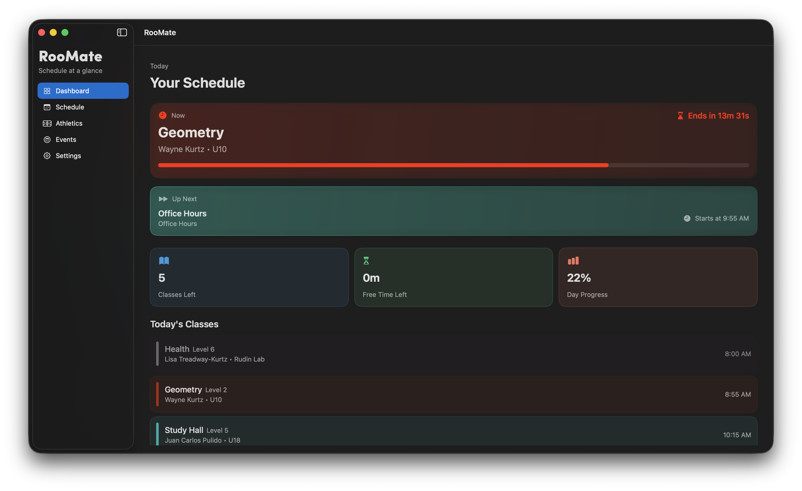
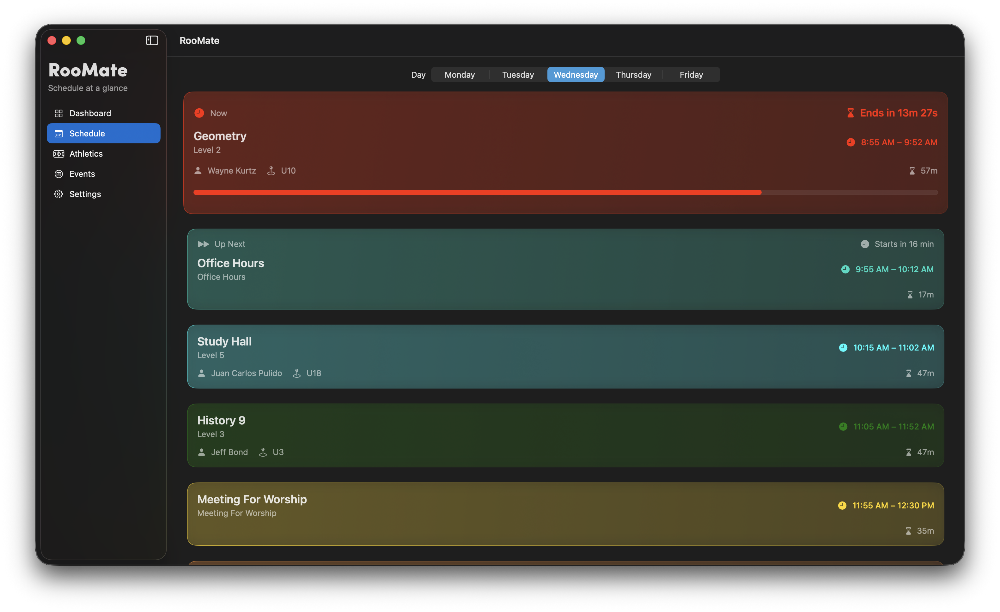
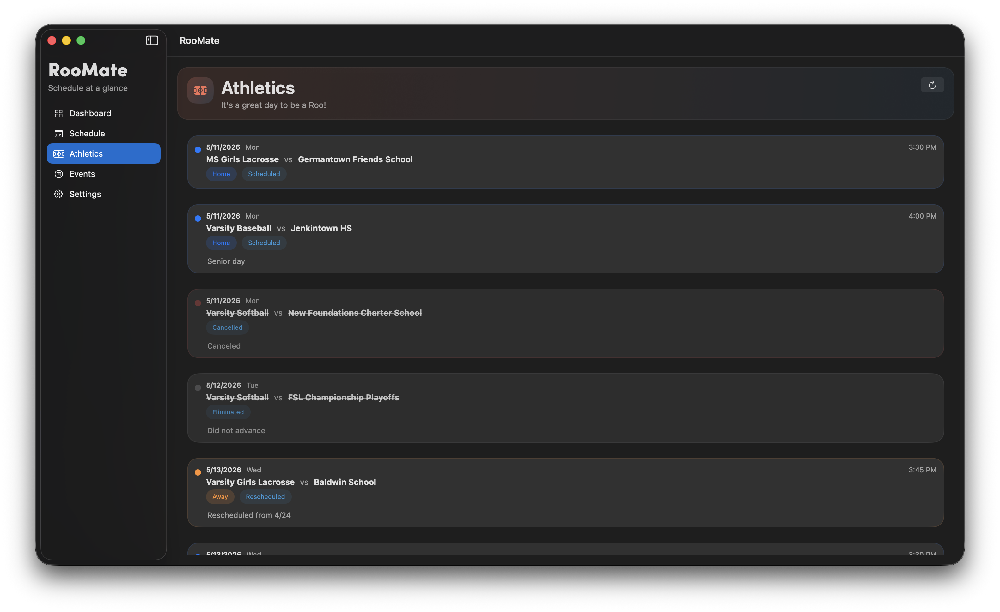
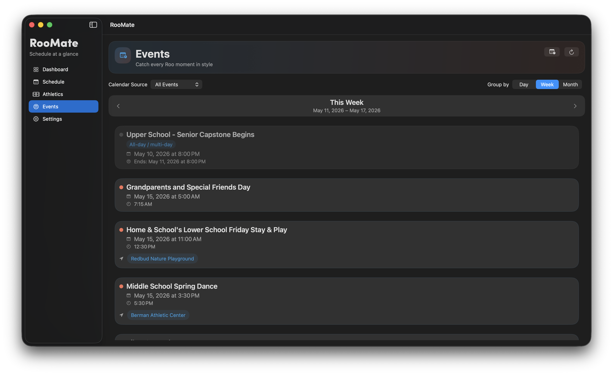
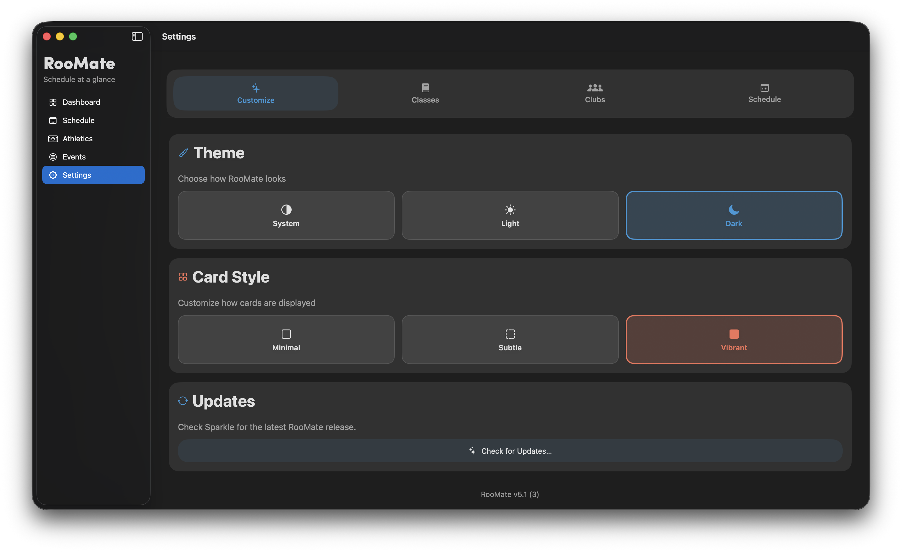

# RooMate

Student dashboard for Abington Friends School

RooMate is a SwiftUI-based macOS application designed to unify school schedules, sports, and events into a single, simple dashboard experience.

It aggregates data from school-provided sources including Google Sheets and official calendar feeds to create a centralized view of student life.

---

## Features

### Schedule
- Class schedule tracking
- Custom class setup per level
- Personalization support for classes and appearance
- Clean daily structure for quick viewing

### Dashboard
- Central home view for daily activity
- Combines schedule, sports, and events
- Quick overview of what is happening today

### Sports Hub
- Live integration with athletics Google Sheets
- Upcoming games and team schedules
- Home and away indicators
- Notes support from athletic updates
- Expanded sports features planned

### Events
- School calendar integration using AFS iCal feeds
- Multiple calendar sources:
  - All Events
  - All School
  - Upper School
  - Middle School
  - Lower School
- Automatic event parsing and sorting

### Clubs & Extracurriculars
- Club tracking and organization
- Meeting times and notes support
- Foundation for expanded extracurricular system

### Customization
- Theme selection
- Card style customization
- Personalized visual settings

---

## Data Sources

- Google Sheets (Athletics schedules and updates)
- AFS Calendar Feeds (school events and schedules)

---

## Tech Stack

- SwiftUI (macOS application)
- Google Sheets integration
- iCal (.ics) calendar feeds

---

## Roadmap

- Expanded Sports Hub (team pages, deeper season tracking)
- RooPac Tracker
- Additional extracurricular support
- Windows version (planned)

---

## Screenshots

### Dashboard

### Schedule

### Sports

### Events

### Settings

---

## Project Status

RooMate is actively in development and expanding into a unified student dashboard platform.

---

## Platforms

- macOS (primary)
- Windows (planned)

---

## Goal

To create a unified, fast, and simple student hub that consolidates school schedules, athletics, and events into one streamlined experience.

---

## Notes

This is a private project and not open source.
